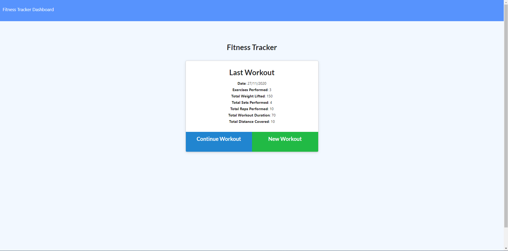
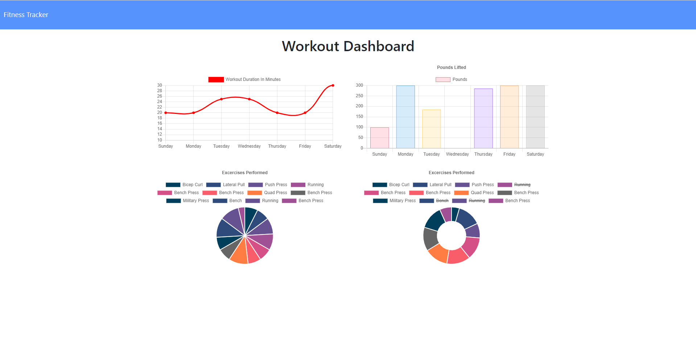

# Workout_Tracker
    

    
[](https://github.com/chrisjmckeown/Workout_Tracker/blob/master/LICENSE)[](https://GitHub.com/chrisjmckeown/Workout_Tracker/graphs/contributors/)[](https://GitHub.com/chrisjmckeown/Workout_Tracker/pull/)
    
## Description
    
A workout tracker to create and track daily routines. Log multiple exercises for a workout on a given day. Track the name, type, weight, sets, reps, and duration of exercise. If the exercise is a cardio exercise, then track the distance travelled. 
    
## Table of Contents
* [Installation](#Installation)
* [Usage](#Usage)
* [License](#License)
* [Contributing](#Contributing)
* [Tests](#Tests)
* [Questions](#Questions)

## Installation
 
1. Download and install [Node.js](http://nodejs.org/) (that will install npm as well)
3. Install the dependancies.<br />
   ```
    dotenv,
    express,
    mongojs,
    mongoose,
    morgan,
    nodemon
   ```
4. To use the seed file.
   ```
   npm run seed
   ```
5. You are done for the setup, run the app using
   ```
   npm run watch
   ```

### Technologies Utilized


   

## Usage
Once installed:

- Run the Workout app using:

```
   node run watch
```

<h3>The Workout app allows:</h3>
<ul>
    <li>
        <p>Create a new workout, or continue with their last workout.</p>
    </li>
    <li>
        <p>Add exercises to a previous workout plan.</p>
    </li>
    <li>
        <p>Add new exercises to a new workout plan.</p>
    </li>
    <li>
        <p>View multiple the combined weight of multiple exercises on the `stats` page.</p>
    </li>
</ul>

Home page:


Stats page:


### Heroku Deployment

View the deployed app here: [deployed app](https://quiet-anchorage-00284.herokuapp.com/) 

## License
 
[](https://github.com/chrisjmckeown/Workout_Tracker/blob/master/LICENSE)

## Contributing

Pull requests are welcome. For major changes, please open an issue first to discuss what you would like to change.
 
[](code_of_conduct.md)

## Tests

Run the application, select the various options avaible, including:

- Can you create a workout.
- Can you create a exercise.
- Can you view the stats? 

## Questions
    
* Follow me at: <a href="https://github.com/chrisjmckeown" target="_blank">https://github.com/chrisjmckeown</a>
    
* Please email with any question at: chris.j.mckeown@hotmail.com
    
© 2020 chrisjmckeown